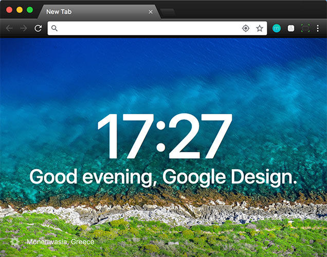
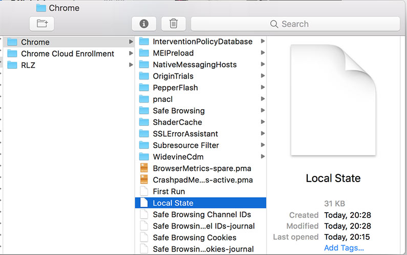
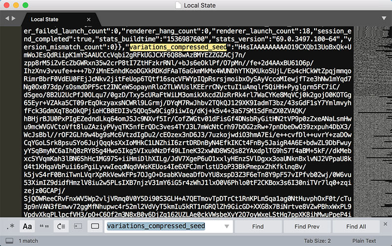
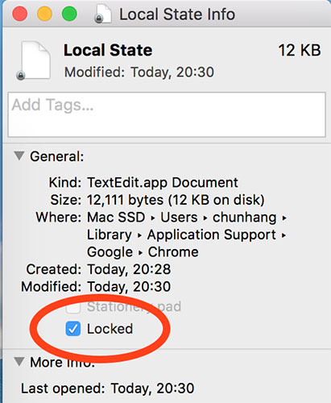

# GoodBye New Google Chrome Design

ATTENTIONS: This method is NOT VALID with Chrome v70+, you have to download v69.x version offline installer before you get started. BTW, if you know how to change Chrome v70+ themes back, please [let me know](../../issues/new).

Google launched its redesigned version of Chrome to celebrate its 10th birthday. Howerver, if you've got used to the old Google Chrome design, you'd have been probably struggling to get rid of the new look, like me.

### Let's Switch Back to the Old Chrome Design!



#### Step 1. Quit your Chrome.

#### Step 2. Go to the Terminal and run the following command to open the `Chrome` folder:

```
open ~/Library/Application\ Support/Google/Chrome
```



#### Step 3. Search for one such file called `Local State`, then right click this file and open it with your favorite editor.

Actually, this file is json. Search for the key `variations_compressed_seed`, its value is a very large string.

#### Step 4. Delete `variations_compressed_seed` key-value pair along with the last comma sign.

```
"variations_compressed_seed": "H4sIAAAAAAA....",
```



#### Step 5. Save your editing, and quit the editor.

#### Step 6. Right click this file again and select 'Get Info', then click the 'locked' checkbox.



You will find your familiar old Chrome theme comes back!
